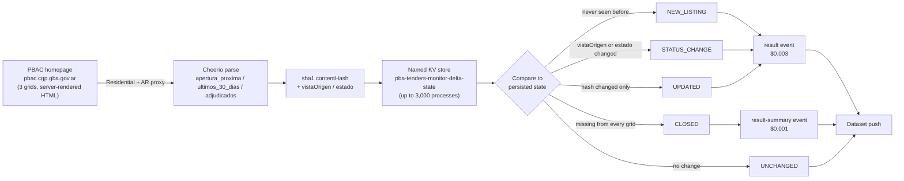

<div align="center">

# PBAC Buenos Aires Province — Tender Delta JSON Feed

**A Buenos Aires Province (PBAC) public tenders monitor for Argentina — upcoming openings, recent listings, and awarded processes, delivered as a delta feed of only what changed, on whatever Apify schedule you configure.**

[](https://apify.com)
[](https://apify.com/stefano_seggio/pba-tenders-monitor)
[](https://www.typescriptlang.org/)
[](LICENSE)

[](https://apify.com/stefano_seggio/pba-tenders-monitor)

*Actor owner console: [console.apify.com/actors/yWvRQyWSyGVLJPtQ7](https://console.apify.com/actors/yWvRQyWSyGVLJPtQ7)*

</div>

## What this monitors

Buenos Aires Province — Argentina's most populous province — publishes its public tenders on **PBAC** (`pbac.cgp.gba.gov.ar`) across three separate grids: upcoming openings, tenders from the last 30 days, and awarded processes. This is the *provincial* procurement portal specifically — not the City of Buenos Aires (CABA) and not Argentina's national procurement system, which run on entirely separate sites with entirely separate data.

PBAC gives no per-tender bookmark URL to track a single listing by. Keeping an eye on it by hand means revisiting all three grids on a schedule and manually comparing each row against what you remember from the last check — a tedious, error-prone process for anyone tracking public-sector bidding opportunities, contract awards, or a portfolio of tenders on behalf of clients. This actor automates that comparison: it extracts all three grids on every run and, in delta mode, reports only what genuinely changed since the previous run — a new listing, a move between grids or a status change, an amended field, or a tender that has disappeared from the site entirely.

Suppliers to provincial organisms, compliance and legal teams tracking new bidding opportunities, and bid consultants managing several clients' tracked tenders all use the same underlying feed: a structured, per-process record with an explicit `event_type`, ready to route, notify on, or log — instead of a manual re-check against memory.

## How it works



PBAC server-renders all three grids directly in the homepage HTML — no login and no browser needed to read them. Each run classifies every row against state persisted in a **named** key-value store (rather than the run's own isolated default store), which is what makes "only new/changed since last run" work across a scheduled run at all. `CLOSED` is only ever reported when `views` covers all three default grids, since a narrower selection would make the fetch a genuine subset of the site.

## Features

| Feature | Detail |
| --- | --- |
| Three-grid extraction | Pulls `apertura_proxima` (upcoming openings), `ultimos_30_dias` (last 30 days), and `adjudicados` (awarded) in one run, selectable via `views` |
| Delta mode | `onlyNew` returns only tenders that are new, changed, amended, or closed since a prior run — tracked in a named, persistent key-value store |
| Four event types | `eventTypes` filters delivery to any of `NEW_LISTING`, `STATUS_CHANGE`, `UPDATED`, `CLOSED` |
| Content-hash change detection | A sha1 fingerprint (`contentHash`) over `descripcion`, `tipoProcedimiento`, `fechaApertura`, and `organismo` catches silent amendments even when status hasn't moved |
| Opening-date filter | `dateRange` (`24h` / `7d` / `30d`) restricts results by `fechaApertura` |
| Hard item cap | `maxItems` bounds records pushed to the dataset per run (PBAC returns every row with no pagination, so this trims output, not the underlying fetch) |
| Residential Argentina proxy by default | `proxyConfiguration` prefills Residential + `AR`, required because PBAC blocks non-residential, non-Argentina traffic |
| Standardized B2B envelope | Every record carries `record_id`, `event_type`, `previousVistaOrigen`, `previousEstado`, `is_new`, `source_url`, and `contentHash` alongside the raw PBAC fields |

## Cost & BYOK Disclosure

**No third-party key required.** This Actor needs nothing beyond your Apify account (and its own prewired Residential + Argentina proxy configuration) — there is no BYOK requirement and no separate PBAC credential involved.

| Event | Price | Charged when |
| --- | --- | --- |
| `result` | **$0.003** per record | `NEW_LISTING`, `STATUS_CHANGE`, or `UPDATED` |
| `result-summary` | **$0.001** per record | `CLOSED` — a derived absence signal, nothing fetched |
| Actor start | **$0.00005** | Once per run |

Precise figures live on the [Apify Store listing](https://apify.com/stefano_seggio/pba-tenders-monitor) pricing tab, which is the pricing source of truth for this Actor — the table above lists the real event names and what triggers them. Residential proxy bandwidth is billed separately through your own Apify plan's proxy/data-transfer usage, not through the per-event prices above.

**Unchanged records are never billed.** Every extracted row is fingerprinted with a sha1 `contentHash` plus its `vistaOrigen`/`estado` pair and compared against the last-known state in a named key-value store; a row whose `contentHash`, `vistaOrigen` and `estado` all still match what this Actor delivered on a previous run is classified `UNCHANGED` and is suppressed before delivery — it never reaches the dataset and is never charged. The underlying page fetch itself is never charged either — only genuinely new information is billed, and a `CLOSED` detection costs a third of a full record because it's inferred from absence rather than newly extracted. A daily monitor finding a handful of changes across all three grids runs to roughly a few cents a day; `fetchFullDetail` does not add a separate charge, since that enrichment is disclosed below as not yet substantively useful and charging more for it would not be honest.

## Quickstart

Also runnable from the [Apify Console](https://console.apify.com/actors/yWvRQyWSyGVLJPtQ7) or the [Apify CLI](https://docs.apify.com/cli):

```bash
apify call stefano_seggio/pba-tenders-monitor --input '{
  "views": ["apertura_proxima", "ultimos_30_dias", "adjudicados"],
  "onlyNew": true,
  "eventTypes": ["NEW_LISTING", "STATUS_CHANGE", "CLOSED"],
  "maxItems": 200,
  "proxyConfiguration": {
    "useApifyProxy": true,
    "apifyProxyGroups": ["RESIDENTIAL"],
    "apifyProxyCountry": "AR"
  }
}'
```

Each dataset item is one tender row plus its delta classification, for example:

```json
{
  "record_id": "2026-338-99-265",
  "event_type": "STATUS_CHANGE",
  "previousVistaOrigen": null,
  "previousEstado": "Publicado",
  "numeroProceso": "2026-338-99-265",
  "descripcion": "Adquisicion de insumos medicos",
  "tipoProcedimiento": "Licitacion Publica",
  "fechaApertura": "2026-09-15 10:00",
  "estado": "En Evaluacion",
  "organismo": "Ministerio de Salud",
  "vistaOrigen": "ultimos_30_dias",
  "scrapedAt": "2026-09-09T14:32:00.000Z"
}
```

### cURL (instant terminal run)

Runs synchronously and returns the resulting dataset items directly in the response - no polling needed. Get your token from [console.apify.com/settings/integrations](https://console.apify.com/settings/integrations).

```bash
curl -X POST "https://api.apify.com/v2/acts/yWvRQyWSyGVLJPtQ7/run-sync-get-dataset-items?token=<YOUR_API_TOKEN>" \
  -H "Content-Type: application/json" \
  -d '{
  "maxItems": 50,
  "onlyNew": true
}'
```

### Python (`apify_client`)

```python
# run_monitor.py
# Calls the PBAC Buenos Aires Province Tenders Monitor actor and prints the
# resulting new/changed/closed tender records.
import os

from apify_client import ApifyClient

client = ApifyClient(os.environ["APIFY_TOKEN"])  # set this in your shell before running

run_input = {
    "views": ["apertura_proxima", "ultimos_30_dias", "adjudicados"],
    "onlyNew": True,
    "eventTypes": ["NEW_LISTING", "STATUS_CHANGE", "CLOSED"],
    "maxItems": 200,
    "proxyConfiguration": {
        "useApifyProxy": True,
        "apifyProxyGroups": ["RESIDENTIAL"],
        "apifyProxyCountry": "AR",
    },
}

# Runs the actor and waits for it to finish before returning
run = client.actor("stefano_seggio/pba-tenders-monitor").call(run_input=run_input)

print(f"Run finished with status: {run['status']}")

# Pull the records the run pushed to its default dataset
dataset_items = client.dataset(run["defaultDatasetId"]).list_items().items
print(f"Retrieved {len(dataset_items)} tender record(s)")

for item in dataset_items:
    event = item["event_type"]
    numero = item["numeroProceso"]
    descripcion = item["descripcion"]
    estado = item["estado"]
    print(f"[{event}] {numero} - {descripcion} ({estado})")
```

A full, runnable copy of this script lives at [`examples/run_monitor.py`](examples/run_monitor.py).

### Node.js (`apify-client`)

```js
// run-monitor.js
// Calls the PBAC Buenos Aires Province Tenders Monitor actor and logs the
// resulting new/changed/closed tender records.
const { ApifyClient } = require('apify-client');

const client = new ApifyClient({
    token: process.env.APIFY_TOKEN, // set this in your shell before running
});

async function main() {
    const input = {
        views: ['apertura_proxima', 'ultimos_30_dias', 'adjudicados'],
        onlyNew: true,
        eventTypes: ['NEW_LISTING', 'STATUS_CHANGE', 'CLOSED'],
        maxItems: 200,
        proxyConfiguration: {
            useApifyProxy: true,
            apifyProxyGroups: ['RESIDENTIAL'],
            apifyProxyCountry: 'AR',
        },
    };

    // Runs the actor and waits for it to finish before returning
    const run = await client.actor('stefano_seggio/pba-tenders-monitor').call(input);

    // Pull the records the run pushed to its default dataset
    const { items } = await client.dataset(run.defaultDatasetId).listItems();

    console.log(`Run finished with status: ${run.status}`);
    console.log(`Retrieved ${items.length} tender record(s)`);

    for (const item of items) {
        console.log(`[${item.event_type}] ${item.numeroProceso} - ${item.descripcion} (${item.estado})`);
    }
}

main().catch((err) => {
    console.error('Run failed:', err.message);
    process.exit(1);
});
```

A full, runnable copy of this script lives at [`examples/run-monitor.js`](examples/run-monitor.js).

## Use this from Claude Desktop, Cursor, or Windsurf (via MCP)

This Actor is also reachable as an MCP tool through Apify's own hosted `@apify/actors-mcp-server`, scoped to just this one Actor via a `?tools=` query string — not the full fleet. Get a token from [Apify Console → Settings → Integrations](https://console.apify.com/settings/integrations) first.

**Claude Desktop** (`%APPDATA%\Claude\claude_desktop_config.json` on Windows, `~/Library/Application Support/Claude/claude_desktop_config.json` on macOS) — uses the `mcp-remote` stdio bridge. Note: `mcp-remote` does not expand shell environment variables inside the JSON string, so paste the literal token in place of `${APIFY_TOKEN}` below, and keep this file out of version control.

```json
{
  "mcpServers": {
    "delta-registry-pba-tenders-monitor": {
      "command": "npx",
      "args": [
        "-y",
        "mcp-remote",
        "https://mcp.apify.com/?tools=stefano_seggio/pba-tenders-monitor",
        "--header",
        "Authorization: Bearer ${APIFY_TOKEN}"
      ]
    }
  }
}
```

**Cursor** (`.cursor/mcp.json` or `~/.cursor/mcp.json`) — native HTTP transport:

```json
{
  "mcpServers": {
    "delta-registry-pba-tenders-monitor": {
      "url": "https://mcp.apify.com/?tools=stefano_seggio/pba-tenders-monitor",
      "headers": {
        "Authorization": "Bearer ${APIFY_TOKEN}"
      }
    }
  }
}
```

**Windsurf** (`~/.codeium/windsurf/mcp_config.json`) — uses `serverUrl`, not `url`. Windsurf's `${env:...}` syntax genuinely does resolve from the environment, unlike Claude Desktop's config above:

```json
{
  "mcpServers": {
    "delta-registry-pba-tenders-monitor": {
      "serverUrl": "https://mcp.apify.com/?tools=stefano_seggio/pba-tenders-monitor",
      "headers": {
        "Authorization": "Bearer ${env:APIFY_TOKEN}"
      }
    }
  }
}
```

Want the full 28-actor fleet in one closed-scope config instead of just this Actor? See [`MCP_INTEGRATION.md`](https://github.com/stefanoseggio/delta-registry-website/blob/main/MCP_INTEGRATION.md) in the `delta-registry-website` repo.

## Input & Output Schema

### Input

Field definitions come straight from [`.actor/input_schema.json`](./.actor/input_schema.json).

| Field | Type | Default | Description |
| --- | --- | --- | --- |
| `views` | string[] | all three | Which PBAC grids to extract: `apertura_proxima` (upcoming openings), `ultimos_30_dias` (last 30 days), `adjudicados` (awarded). |
| `fetchFullDetail` | boolean | `false` | Simulates the per-process postback. Known limitation: currently returns only a short status label, not the full Pliego document text - see Known limitations below. |
| `maxItems` | integer | `200` | Hard cap on the number of tender processes returned this run, across all selected views. |
| `proxyConfiguration` | object | Residential + `AR` | Required: PBAC blocks non-residential, non-Argentina traffic. Verified live - a datacenter proxy times out identically to no proxy at all. Do not switch to datacenter. |
| `onlyNew` | boolean | `false` | Delta mode: return only tenders that are new, changed `vistaOrigen`/`estado`, amended or closed since a prior run (tracked in a named key-value store). `CLOSED` is only computed when `views` covers all 3 default views. |
| `eventTypes` | string[] | all four | Which kinds of change to deliver when `onlyNew` is on (ignored when it's off): `NEW_LISTING`, `STATUS_CHANGE`, `UPDATED`, `CLOSED`. |
| `dateRange` | string (enum) | - | `24h` / `7d` / `30d` - restricts results by `fechaApertura`. Independent of `onlyNew`. Note: `fechaApertura` is routinely a future date for `apertura_proxima` rows, so this filter will not match those rows. |

### Output

One real record from this Actor's own dataset, matching `.actor/dataset_schema.json`:

```json
{
  "numeroProceso": "2026-338-99-265",
  "descripcion": "Adquisicion de mobiliario escolar para establecimientos de la Region 5",
  "tipoProcedimiento": "Licitacion Publica",
  "fechaApertura": "23/09/2026 11:00",
  "estado": "Publicado",
  "organismo": "Direccion General de Cultura y Educacion",
  "vistaOrigen": "ultimos_30_dias",
  "detalleCompleto": null,
  "scrapedAt": "2026-09-15T14:15:20.000Z",
  "record_id": "2026-338-99-265",
  "event_type": "NEW_LISTING",
  "previousVistaOrigen": null,
  "previousEstado": null,
  "is_new": true,
  "source_url": "https://pbac.cgp.gba.gov.ar/",
  "contentHash": "c8e3f6b9d2a5c8e1f4b7d03a8f1e6c9b2d450712"
}
```

| Field | Description |
| --- | --- |
| `numeroProceso` | PBAC process number, e.g. `2026-338-99-265`. |
| `descripcion` | Short description of the tender. |
| `tipoProcedimiento` | `Licitacion Publica`, `Licitacion Privada`, or `Procedimiento Abreviado`. |
| `fechaApertura` | Opening date and time as shown by PBAC. |
| `estado` | `Publicado`, `En Apertura`, `En Evaluacion`, `Disponible Para Adjudicar`, etc. |
| `organismo` | Contracting unit/agency. |
| `vistaOrigen` | Which PBAC grid this row came from: `apertura_proxima`, `ultimos_30_dias`, or `adjudicados`. |
| `detalleCompleto` | Full document preview text, only populated when `fetchFullDetail` is enabled (see Known limitations). |
| `scrapedAt` | ISO timestamp of extraction. |
| `record_id` | Same value as `numeroProceso`. |
| `event_type` | `NEW_LISTING`, `STATUS_CHANGE`, `UPDATED`, `UNCHANGED` (only when `onlyNew` is off), or `CLOSED`. |
| `previousVistaOrigen` / `previousEstado` | Set only when `event_type=STATUS_CHANGE` and that field changed. |
| `is_new` | `true` if this id was not in the persisted seen-set when this run started. |
| `source_url` | The PBAC homepage - this portal has no per-tender deep link. |
| `contentHash` | sha1 fingerprint used to detect `UPDATED` between runs. |

## Why not just scrape it yourself

- **Zero infrastructure** — no server, container, or cron box to keep alive between checks.
- **Managed scheduling** — put the actor on an Apify schedule and it runs unattended, with retries and logs handled by the platform.
- **No proxy or session babysitting** — PBAC blocks non-residential, non-Argentina traffic outright; the Residential + Argentina proxy this actor requires is prewired in, rather than something you'd have to source, rotate, and pay for separately.
- **Built-in delta and change detection** — the named key-value store, content-hash fingerprinting, and four-way event classification (new / status change / updated / closed) are the actual hard part of monitoring PBAC by hand, already solved and exposed as a clean `event_type` field.

## Known limitations

- **`fetchFullDetail` is thin today.** The per-process postback mechanism works — it returns a 200 with genuinely new content — but the text captured is a short status label, not the full Pliego document text. The real content likely sits in a nested panel not yet mapped. Disclosed here rather than shipped silently; the three summary grids, the actor's core value, are unaffected.
- Column labels (`tipoProcedimiento`, `estado`) are extracted as free text exactly as PBAC renders them, so values may vary slightly across process types.
- `dateRange` filters on `fechaApertura` (scheduled opening date), which is routinely a future date for `apertura_proxima` rows — it will not match those rows.
- Whether PBAC's own grids are internally capped (e.g. showing only the most recent N rows) has not been independently re-verified against a full live capture.
- Requires a Residential + Argentina proxy, handled automatically by the default `proxyConfiguration` — do not switch this to a datacenter proxy.
- **No contractual support SLA.** This Actor is built and maintained by an independent developer; bug reports and feature requests go through the Apify Store's Issues tab and are typically addressed within about 48 hours.

## Contributing & Local Setup

This repository contains the Actor's real, buildable TypeScript source (`src/`) — there is no proprietary logic held back from GitHub. To work on it locally:

```bash
git clone https://github.com/stefanoseggio/pba-tenders-monitor.git
cd pba-tenders-monitor
npm install

# Run against the real pbac.cgp.gba.gov.ar portal, Apify-CLI style:
apify login          # one-time, needs an Apify account
apify run             # runs src/main.ts via the Apify SDK's local dev flow

# Or run the TypeScript entrypoint directly:
npm run start:dev     # tsx src/main.ts

# Build, lint and test before opening a PR:
npm run build          # tsc
npm run lint
npm test               # vitest run (mocked fixtures)
```

Source layout: `src/main.ts` (Actor entrypoint), `src/routes.ts` (Crawlee route handlers for the three PBAC grids), `src/parsers/` (Cheerio HTML parsing per grid), `src/delta.ts` (event classification: `NEW_LISTING`/`STATUS_CHANGE`/`UPDATED`/`CLOSED`), `src/fingerprint.ts` (sha1 `contentHash`), `src/dateFilter.ts` (`dateRange` filtering), `src/state.ts` (named key-value delta store), `src/types.ts` (shared types). Real unit tests live in `test/` with fixture-based coverage for parsing, delta classification and the Actor entrypoint.

Bug reports and feature requests are handled through the Apify Store **Issues** tab for this Actor (see Known limitations above) rather than GitHub Issues, since that is where paying users of the published Actor already are — but pull requests against this repository are welcome.

## License

The source code in this repository is licensed under the [Apache License 2.0](LICENSE).

---

<div align="center">

**About Delta Registry** — this actor is part of *Delta Registry*, a pay-per-event regulatory & compliance data infrastructure operation covering public procurement portals across multiple jurisdictions. For professional inquiries or enterprise licensing, connect on [LinkedIn](https://www.linkedin.com/in/stefanoseggio-deltaregistry); for the rest of the fleet, see [github.com/stefanoseggio](https://github.com/stefanoseggio).

</div>
