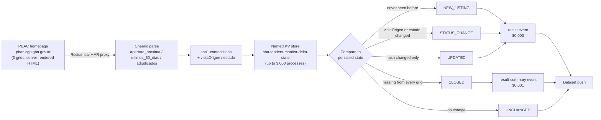

<div align="center">

# PBAC Buenos Aires Province — Tender Delta JSON Feed

**A Buenos Aires Province (PBAC) public tenders monitor for Argentina — upcoming openings, recent listings, and awarded processes, delivered as a delta feed of only what changed.**

[](https://apify.com)
[](https://apify.com/stefano_seggio/pba-tenders-monitor)
[](https://www.typescriptlang.org/)
[](LICENSE)

[](https://apify.com/stefano_seggio/pba-tenders-monitor)

*Actor owner console: [console.apify.com/actors/yWvRQyWSyGVLJPtQ7](https://console.apify.com/actors/yWvRQyWSyGVLJPtQ7)*

</div>

## What this monitors

Buenos Aires Province — Argentina's most populous province — publishes its public tenders on **PBAC** (`pbac.cgp.gba.gov.ar`) across three separate grids: upcoming openings, tenders from the last 30 days, and awarded processes. This is the *provincial* procurement portal specifically — not the City of Buenos Aires (CABA) and not Argentina's national procurement system, which run on entirely separate sites with entirely separate data.

PBAC gives no per-tender bookmark URL to track a single listing by. Keeping an eye on it by hand means revisiting all three grids on a schedule and manually comparing each row against what you remember from the last check — a tedious, error-prone process for anyone tracking public-sector bidding opportunities, contract awards, or a portfolio of tenders on behalf of clients. This actor automates that comparison: it extracts all three grids on every run and, in delta mode, reports only what genuinely changed since the previous run — a new listing, a move between grids or a status change, an amended field, or a tender that has disappeared from the site entirely.

Suppliers to provincial organisms, compliance and legal teams tracking new bidding opportunities, and bid consultants managing several clients' tracked tenders all use the same underlying feed: a structured, per-process record with an explicit `event_type`, ready to route, notify on, or log — instead of a manual re-check against memory.

## How it works



PBAC server-renders all three grids directly in the homepage HTML — no login and no browser needed to read them. Each run classifies every row against state persisted in a **named** key-value store (rather than the run's own isolated default store), which is what makes "only new/changed since last run" work across a scheduled run at all. `CLOSED` is only ever reported when `views` covers all three default grids, since a narrower selection would make the fetch a genuine subset of the site.

## Features

| Feature | Detail |
| --- | --- |
| Three-grid extraction | Pulls `apertura_proxima` (upcoming openings), `ultimos_30_dias` (last 30 days), and `adjudicados` (awarded) in one run, selectable via `views` |
| Delta mode | `onlyNew` returns only tenders that are new, changed, amended, or closed since a prior run — tracked in a named, persistent key-value store |
| Four event types | `eventTypes` filters delivery to any of `NEW_LISTING`, `STATUS_CHANGE`, `UPDATED`, `CLOSED` |
| Content-hash change detection | A sha1 fingerprint (`contentHash`) over `descripcion`, `tipoProcedimiento`, `fechaApertura`, and `organismo` catches silent amendments even when status hasn't moved |
| Opening-date filter | `dateRange` (`24h` / `7d` / `30d`) restricts results by `fechaApertura` |
| Hard item cap | `maxItems` bounds records pushed to the dataset per run (PBAC returns every row with no pagination, so this trims output, not the underlying fetch) |
| Residential Argentina proxy by default | `proxyConfiguration` prefills Residential + `AR`, required because PBAC blocks non-residential, non-Argentina traffic |
| Standardized B2B envelope | Every record carries `record_id`, `event_type`, `previousVistaOrigen`, `previousEstado`, `is_new`, `source_url`, and `contentHash` alongside the raw PBAC fields |

## Quick start

```bash
apify call pba-tenders-monitor --input '{
  "views": ["apertura_proxima", "ultimos_30_dias", "adjudicados"],
  "onlyNew": true,
  "eventTypes": ["NEW_LISTING", "STATUS_CHANGE", "CLOSED"],
  "maxItems": 200,
  "proxyConfiguration": {
    "useApifyProxy": true,
    "apifyProxyGroups": ["RESIDENTIAL"],
    "apifyProxyCountry": "AR"
  }
}'
```

Each dataset item is one tender row plus its delta classification, for example:

```json
{
  "record_id": "2026-338-99-265",
  "event_type": "STATUS_CHANGE",
  "previousVistaOrigen": null,
  "previousEstado": "Publicado",
  "numeroProceso": "2026-338-99-265",
  "descripcion": "Adquisicion de insumos medicos",
  "tipoProcedimiento": "Licitacion Publica",
  "fechaApertura": "2026-09-15 10:00",
  "estado": "En Evaluacion",
  "organismo": "Ministerio de Salud",
  "vistaOrigen": "ultimos_30_dias",
  "scrapedAt": "2026-09-09T14:32:00.000Z"
}
```

## Instant Terminal Run (cURL)

Runs synchronously and returns the resulting dataset items directly in the response - no polling needed. Get your token from [console.apify.com/settings/integrations](https://console.apify.com/settings/integrations).

```bash
curl -X POST "https://api.apify.com/v2/acts/yWvRQyWSyGVLJPtQ7/run-sync-get-dataset-items?token=<YOUR_API_TOKEN>" \
  -H "Content-Type: application/json" \
  -d '{
  "maxItems": 50,
  "onlyNew": true
}'
```

## Sample Extracted Dataset (JSON)

One real record from this Actor's own dataset, matching `.actor/dataset_schema.json`:

```json
{
  "numeroProceso": "2026-338-99-265",
  "descripcion": "Adquisicion de mobiliario escolar para establecimientos de la Region 5",
  "tipoProcedimiento": "Licitacion Publica",
  "fechaApertura": "23/09/2026 11:00",
  "estado": "Publicado",
  "organismo": "Direccion General de Cultura y Educacion",
  "vistaOrigen": "ultimos_30_dias",
  "detalleCompleto": null,
  "scrapedAt": "2026-09-15T14:15:20.000Z",
  "record_id": "2026-338-99-265",
  "event_type": "NEW_LISTING",
  "previousVistaOrigen": null,
  "previousEstado": null,
  "is_new": true,
  "source_url": "https://pbac.cgp.gba.gov.ar/",
  "contentHash": "c8e3f6b9d2a5c8e1f4b7d03a8f1e6c9b2d450712"
}
```

## Pricing (Pay-Per-Event)

| Event | Price | Charged when |
| --- | --- | --- |
| `result` | **$0.003** per record | `NEW_LISTING`, `STATUS_CHANGE`, or `UPDATED` |
| `result-summary` | **$0.001** per record | `CLOSED` — a derived absence signal, nothing fetched |

`UNCHANGED` rows and the underlying page fetch itself are never charged — only genuinely new information is billed, and a `CLOSED` detection costs a third of a full record because it's inferred from absence rather than newly extracted. A daily monitor finding a handful of changes across all three grids runs to roughly a few cents a day; `fetchFullDetail` does not add a separate charge, since that enrichment is disclosed below as not yet substantively useful and charging more for it would not be honest.

## Why not just scrape it yourself

- **Zero infrastructure** — no server, container, or cron box to keep alive between checks.
- **Managed scheduling** — put the actor on an Apify schedule and it runs unattended, with retries and logs handled by the platform.
- **No proxy or session babysitting** — PBAC blocks non-residential, non-Argentina traffic outright; the Residential + Argentina proxy this actor requires is prewired in, rather than something you'd have to source, rotate, and pay for separately.
- **Built-in delta and change detection** — the named key-value store, content-hash fingerprinting, and four-way event classification (new / status change / updated / closed) are the actual hard part of monitoring PBAC by hand, already solved and exposed as a clean `event_type` field.

## Known limitations

- **`fetchFullDetail` is thin today.** The per-process postback mechanism works — it returns a 200 with genuinely new content — but the text captured is a short status label, not the full Pliego document text. The real content likely sits in a nested panel not yet mapped. Disclosed here rather than shipped silently; the three summary grids, the actor's core value, are unaffected.
- Column labels (`tipoProcedimiento`, `estado`) are extracted as free text exactly as PBAC renders them, so values may vary slightly across process types.
- `dateRange` filters on `fechaApertura` (scheduled opening date), which is routinely a future date for `apertura_proxima` rows — it will not match those rows.
- Whether PBAC's own grids are internally capped (e.g. showing only the most recent N rows) has not been independently re-verified against a full live capture.
- Requires a Residential + Argentina proxy, handled automatically by the default `proxyConfiguration` — do not switch this to a datacenter proxy.

---

<div align="center">

**About Delta Registry** — this actor is part of *Delta Registry*, a pay-per-event regulatory & compliance data infrastructure operation covering public procurement portals across multiple jurisdictions. For professional inquiries or enterprise licensing, connect on [LinkedIn](https://www.linkedin.com/in/stefanoseggio-deltaregistry); for the rest of the fleet, see [github.com/stefanoseggio](https://github.com/stefanoseggio).

</div>
